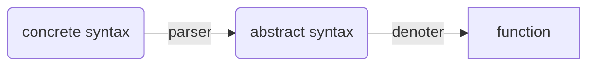

Denotational Semantics
======================

It is usual to distinguish between the `concrete syntax`
of a language and the `abstract syntax` it denotes.
Concrete syntax defines the way that a language is
actually written on paper or a computer screen, while
the abstract syntax specifies the relationship between
parts of a language. Denotational Semantics is based on
the abstract syntax and is not specific to any
particular language.

Here are some examples of the concrete syntax of
various languages:

1. C, Perl, TypeScript, Java or JavaScript:

```ts
if (x == 42) {
	LOG("Has meaning");
	}
else {
	LOG("No meaning");
	}
```

2. Also C, Perl, TypeScript, Java or JavaScript:

```java
if (x == 42) {
	LOG("Has meaning");
} else {
	LOG("No meaning");
}
```

3. CoffeeScript or Civet:

```coffee
if x == 42
	LOG "Has meaning"
else
	LOG "No meaning"
```

4. Pascal:

```pascal
if (x = 42) then
	begin
	LOG('Has meaning')
	end
else
	begin
	LOG('No meaning')
	end;
```

However, the abstract syntax of each of the above
is something like:

```javascript
{
	kind: 'program'
	lStatements: [
		{
			kind: 'ifStmt'
			condition: {
				kind 'binaryOp'
				op: 'equal'
				left:  {kind: 'variable', name: 'x'}
				right: {kind: 'constant', value: 42}
				}
			ifTrue: {
				kind: 'functionCall'
				name: 'LOG'
				lArgs: [
					{kind: 'string', value: 'Has Meaning'}
					]
				}
			ifFalse: {
				kind: 'functionCall'
				name: 'LOG'
				lArgs: [
					{kind: 'string', value: 'No Meaning'}
					]
				}
			}
		]
	}
```
This structure is also known as an `abstract syntax tree`
(aka AST).

The most important thing to notice is that this abstract
syntax is correct for all of the above examples of concrete
syntax. Abstract syntax doesn't include information about
how whitespace, parentheses or semicolons are used in the
concrete syntax because those are not important to the
semantics of the program. These elements are only there
to control the parsing of the concrete syntax to produce
the abstract syntax tree.

NOTE: The names of the keys and how the values are represented
may vary between different implementations of abstract syntax.
For example, the field named 'kind' above may instead be
'type', though some languages will disallow this as a field
name.

The purpose of a `parser` is to convert the concrete syntax
of a language to an AST. Many parsers will perform a
transformation beyond that, but the first step is still
to create an AST.

Semantic Functions
------------------

We assume that the semantics, i.e. the meaning, of a
computer program is a function, which we call the
corresponding `semantic function`. This is a function in
the usual mathematical sense.

Whenever we work with functions, we must first define the
types of values we are working with. We will be using
TypeScript in our examples, so the types of values we will
be working with will be valid TypeScript types. The most
commonly used are strings, numbers, and objects.
However, we will separate objects into those that are
arrays and those that are not, which we'll call hashes.

We will define a `state` as a hash which has identifiers
as keys, where the key's associated value can be any of
the value types mentioned above.

A `program` will be treated as a function which transforms
one state into another state. For example, given the
program below (we'll use TypeScript in our examples, though
any language with an assignment statement could be used):

```ts
let x = 42;
```
a parser would produce an AST like:

```ts
{
	kind: 'program'
	lStatements: [
		{
			kind: 'assignment'
			l_value: {
				kind: 'variable'
				name: 'x'
				}
			r_value: {
				kind: 'constant'
				value: 42
				}
			}
		]
	}
```
The corresponding `semantic function` would produce the
following output given the displayed input:

| input        | output        |
| -----        | ------        |
| {}           | {x: 42}       |
| {y: 3}       | {x: 42, y: 3} |
| {x: 5}       | {x: 42}       |
| {x: 5, y: 3} | {x: 42, y: 3} |

In other words, it would set the key x to 42, whether a
value for x was there initially or not, and would not
modify any other keys.

Here, then, is the flow that we're talking about:



